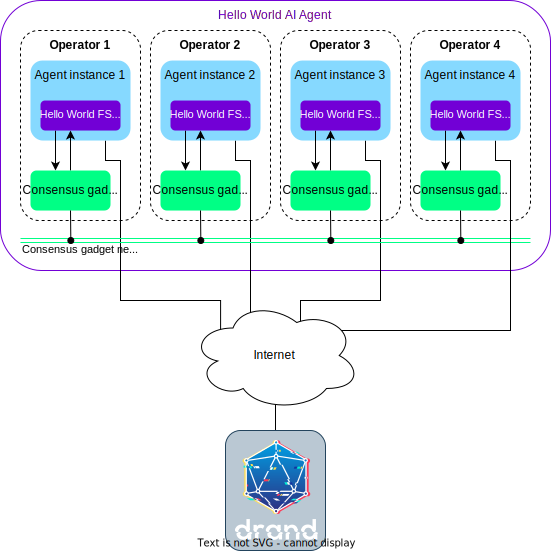
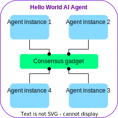
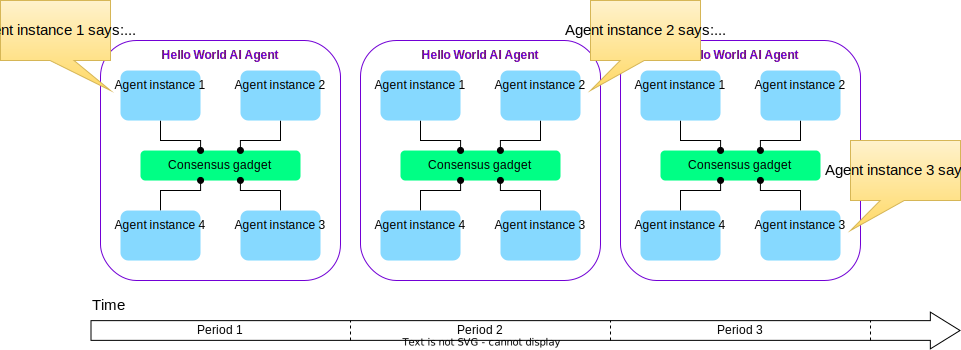
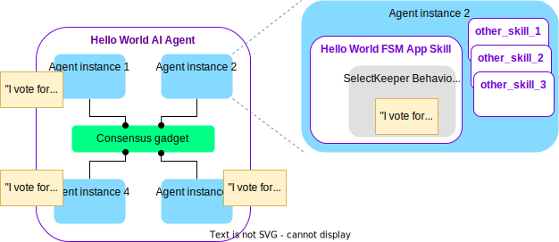
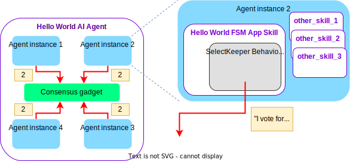
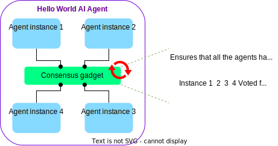
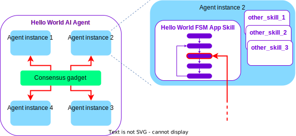
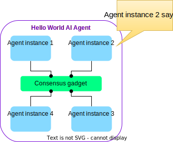
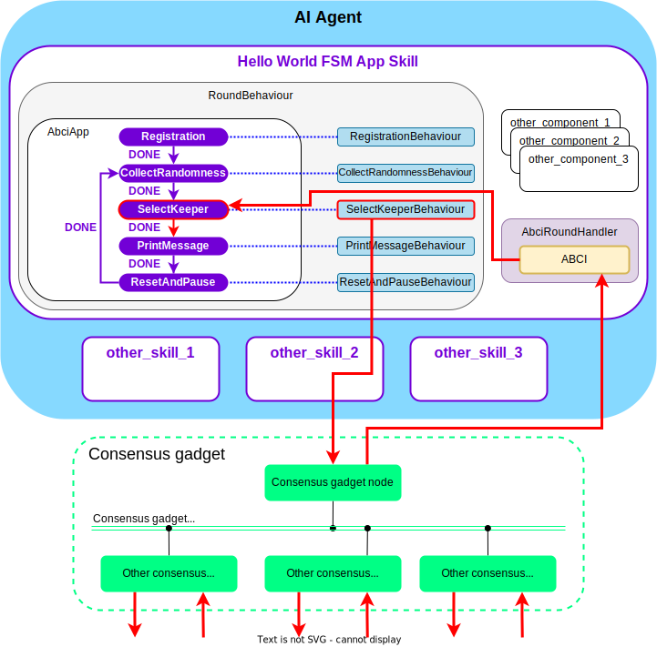

The Hello World AI agent provides an overview of the main components of an [AI agent](https://stack.olas.network/open-autonomy/get_started/what_is_an_agent_service/) and how they work together. The goal of this AI agent is to help new users of Open Autonomy understand how the components of an AI agent work. While the AI agent itself is very simple, it demonstrates common features found in many AI agents and can be used as a starting point for building your own AI agent with more complex functionalities.

## Architecture of the demo+

The demo is composed of:

* 4 Docker containers implementing the 4 agent instances of the AI agent (`abci0`, `abci1`, `abci2`, `abci3`), and
* 4 Docker containers implementing a [Tendermint](https://tendermint.com/) node for each agent instance (`node0`, `node1`, `node2`, `node3`).

The agent instances connect to the remote [DRAND](https://drand.love) service through the Internet during the execution
of the demo.

<figure markdown>
  {align=center}
  <figcaption>Hello World AI agent demo architecture with four agent instances</figcaption>
</figure>

## Running the demo

You can find the instructions on how to run the Hello World AI agent in the [quick start](https://stack.olas.network/open-autonomy/guides/quick_start/) guide.

If you have [set up the framework](https://stack.olas.network/open-autonomy/guides/set_up/#set-up-the-framework), you can fetch the source code of the Hello World AI agent:

```bash
autonomy fetch valory/hello_world:0.1.0:<hash> --alias hello_world_agent
```

and the Hello World AI agent:

```bash
autonomy fetch valory/hello_world:0.1.0:<hash> --service --alias hello_world_service
```

## Details of the demo

The functionality of the AI agent is extremely simple. Namely, each agent instance will output at different times a `HELLO_WORLD!` message on their local console. The execution timeline is divided into *periods*, and within each period, only a nominated agent instance(keeper) will print the `HELLO_WORLD!` message. The other agent instances will just print a neutral face `:|`.

!!! info

    In the context of AI agent, you can think of a *period* as an interval where the service executes an iteration of its intended functionality (e.g., checking some price on a market, execute an investment strategy, or in this demo, printing a message).

Recall that agent instances synchronize their state using the *consensus gadget*. For clarity, we will simplify the consensus gadget infrastructure (the consensus gadget nodes plus the consensus gadget network) in a single green box.

<figure markdown>
{align="center"}
<figcaption>A simplified view of the Hello world AI agent architecture</figcaption>
</figure>

!!! warning "Important"

    Every AI agent is connected to the *consensus gadget* through its *consensus gadget node*:

    * The consensus gadget is the component that makes possible for the agent instances to synchronise state data. This allows them to, e.g. reach agreement on certain actions or reconcile information.

    * Anything happening at the consensus network level is completely abstracted away so that developers can see it as a given functionality. An application run by the AI agent can be thought and developed as a single "virtual" application, and the framework will take care of replicating it.

    * Currently, the consensus gadget is implemented using [Tendermint](https://tendermint.com/).

This is what the AI agent execution looks like:

<figure markdown>

<figcaption>Hello World AI agent in action</figcaption>
</figure>

The main questions that we try to answer in the sections below are:

* What are the main components of the {{open_autonomy}} framework to implement an AI agent?
* How do these components work?

### The FSM of the AI agent

As discussed in the [overview of the development process](https://stack.olas.network/open-autonomy/guides/overview_of_the_development_process/), the first steps when designing an AI agent are [draft the AI agent idea and define the FSM specification](https://stack.olas.network/open-autonomy/guides/draft_service_idea_and_define_fsm_specification/) that represents its business logic. This is a representation of the Hello World AI agent FSM:

<figure markdown>

<figcaption>Diagram of individual operations of the Hello World AI agent</figcaption>
</figure>

These are the states of the AI agent:

* **Registration.** This is a preliminary state where each agent instance commits to participate actively in the AI agent.
* **CollectRandomness.** All agent instances connect to the [DRAND](https://drand.love) remote service and retrieve the latest published random value.
* **SelectKeeper.** Using that random value as seed, the agent instances nominate randomly an instance (keeper) to execute the AI agent action.
* **PrintMessage.** The keeper executes the main action of the AI agent: prints the `HELLO_WORLD!` message.
* **ResetAndPause.** A state where agent instances wait a bit before re-starting again the main cycle of the AI agent.

And these the possible events (not all events can occur at every state):

* **DONE.** The state has successfully completed its intended purpose.
* **NO_MAJORITY.** There is no majority (more than 2/3) of agent instances that agree in the outcome of the state.
* **TIMEOUT.** Not all agent instances responded within a specified amount of time.

You can see above how the AI agent transits from one state to another given the event occurred at each one. The synchronized state enforced by the consensus gadget means that **all the agent instances have the same view of the AI agent FSM**, and **all the instances execute the same transitions**. This is one of the key concepts of the {{open_autonomy}} framework.

!!! warning "A note on determinism"

    One of the key points in an AI agent is determinism. It is very important that all the agent instances execute deterministic actions at each step, otherwise it will be impossible to synchronize their shared state.

    For example, if the AI agent needs to execute some random action, all agent instances must retrieve the random seed from a common source, in this case, the [DRAND](https://drand.love) service.

Given the description of the AI agent, it is immediate to obtain the FSM specification file.

???+ example "The Hello World AI agent `fsm_specification.yaml` file"

    ```yaml title="fsm_specification.yaml"
    alphabet_in:
    - DONE
    - NO_MAJORITY
    - RESET_TIMEOUT
    - ROUND_TIMEOUT
    default_start_state: RegistrationRound
    final_states: []
    label: HelloWorldAbciApp
    start_states:
    - RegistrationRound
    states:
    - CollectRandomnessRound
    - PrintMessageRound
    - RegistrationRound
    - ResetAndPauseRound
    - SelectKeeperRound
    transition_func:
        (CollectRandomnessRound, DONE): SelectKeeperRound
        (CollectRandomnessRound, NO_MAJORITY): CollectRandomnessRound
        (CollectRandomnessRound, ROUND_TIMEOUT): CollectRandomnessRound
        (PrintMessageRound, DONE): ResetAndPauseRound
        (PrintMessageRound, ROUND_TIMEOUT): RegistrationRound
        (RegistrationRound, DONE): CollectRandomnessRound
        (ResetAndPauseRound, DONE): CollectRandomnessRound
        (ResetAndPauseRound, NO_MAJORITY): RegistrationRound
        (ResetAndPauseRound, RESET_TIMEOUT): RegistrationRound
        (SelectKeeperRound, DONE): PrintMessageRound
        (SelectKeeperRound, NO_MAJORITY): RegistrationRound
        (SelectKeeperRound, ROUND_TIMEOUT): RegistrationRound
    ```

### The {{fsm_app}} of the AI agent

Each agent blueprint is composed of a number of components, namely, [connections](https://stack.olas.network/open-aea/connection/), [protocols](https://stack.olas.network/open-aea/protocol/), [contracts](https://stack.olas.network/open-aea/contract/) and [skills](https://stack.olas.network/open-aea/skill/). In order to become part of an AI agent, the agent blueprint requires a special skill: the {{fsm_app}}. The **{{fsm_app}} skill** is the component that processes events,transits the states of the AI agent FSM, and executes the actions of the AI agent.

<figure markdown>

<figcaption>Zoom on a Hello World AI agent.</figcaption>
</figure>

The {{fsm_app}} is a complex component that consists of a number of classes. Below we list the main ones.

For each state of the AI agent FSM:

* A [`Behaviour`](https://stack.olas.network/open-autonomy/key_concepts/abci_app_async_behaviour/): The class that executes the proactive action at each state. For example, cast a vote for a keeper, print a message on screen, send a transaction on a blockchain, etc.
* A [`Payload`](https://stack.olas.network/open-autonomy/key_concepts/abci_app_async_behaviour/): The message exchanged between agent instances in the state to indicate completion of the action. For example, a message containing what keeper the agent instance is voting for.
* A [`Round`](https://stack.olas.network/open-autonomy/key_concepts/abci_app_abstract_round/): The class that processes the input from the consensus gadget and outputs the appropriate events to make the next transition. For example, output the event DONE when all agent bluprint instances have cast they vote for a keeper.

Additionally, the following two classes:

* [`AbciApp`](https://stack.olas.network/open-autonomy/key_concepts/abci_app_class/): The class that defines the FSM itself and the transitions between states according to the FSM.
* [`RoundBehaviour`](https://stack.olas.network/open-autonomy/key_concepts/abci_app_abstract_round_behaviour/): The main class of the {{fsm_app}} skill, which aggregates the `AbciApp` and establishes a one-to-one relationship between the rounds and behaviours of each state.

In summary, the Hello World AI agent {{fsm_app}} requires 5 `Behaviours`, 5 `Payloads`, 5 `Rounds`, 1 `AbciApp` and 1 `RoundBehaviour`.

!!! info "Agent Blueprints vs Agent instances"

    All agent instances in an AI agent are implemented by the same codebase. We call such codebase an _agent blueprint_, and we call each of the actual instances an _agent instance_. We often use _agent instance_ for short when there is no risk of confusion and it is clear from the context which of the two terms we are referring to.

    Each agent instance in an AI agent can be parameterized with their own set of keys, addresses and other required attributes.

### How the {{fsm_app}} works

Let us focus on what happens inside the {{fsm_app}} of an agent instance when the AI agent is located in the SelectKeeper state and it transitions to the PrintMessage state.

1. **Execute the action and prepare the payload.** The `SelectKeeperBehaviour` is in charge of two tasks:

      * Execute the intended action, that is, determine which agent instance will be voted for as the new keeper. The choice is made deterministically, based on the randomness retrieved from [DRAND](https://drand.love).
      * Prepares the `SelectKeeperPayload`, which contains its selection.

    

2. **Send the payload.** The `SelectKeeperBehaviour` is in charge sends the payload to the consensus gadget.

    

3. **Reach consensus.** The consensus gadget reads all the agent instances' outputs, and ensures that all instances have the same consistent view. The gadget takes the responsibility of executing the consensus algorithm, which is abstracted away to the developer. The consensus gadget uses a short-lived blockchain to execute the consensus algorithm.

    

    !!! note
        "Reaching consensus" does not mean that the consensus gadget ensures that all the agent instance send the same payload. Rather, it means that all the agent instance have a _consistent view_ on what payload was sent by each of them. In this particular case, however all agent instance cast the same vote.

4. **Callback to the {{fsm_app}}.** Once the consensus phase is finished, the `SelectKeeperRound` receives a callback and processes the outputs. Based on that, it casts an event. In this case, if strictly more than $2/3$ of the agent instance voted for a certain keeper, it casts the event `DONE`.

    

5. **Transition to the next state.** The event `DONE` is received by the `AbciApp` class, which executes the transition to the next state (PrintMessage).

    

The executions of further state transitions can be easily mapped with what has been presented here for the transition SelectKeeper $\rightarrow$ PrintMessage.

???+ example "Transition PrintMessage $\rightarrow$ ResetAndPause"

    Following the same steps as above, this is what would happen:

    1. The `PrintMessageBehaviour`, executes the main functionality. For the chosen keeper, it will be printing the `HELLO_WORLD` message. The rest of the agent instance simply print a neutral face.
        <figure markdown>
        
        <figcaption>Result of the execution the second period of the Hello World AI agent</figcaption>
        </figure>

    2.   The `PrintMessageBehaviour` sends a `PrintMessagePayload` to the consensus gadget, indicating what was the message it printed by each agent.
    3.   The consensus gadget executes the consensus protocol ensuring a consistent view for all the agent instance.
    4.   The `PrintMessageRound` receives a callback, and after checking that all agent instance have responded it will produce the `DONE` event.
    5.   The `AbciApp` processes the event `DONE`, and moves to the next state, ResetAndPause.

!!! note

    Observe that whereas in the SelectKeeper state we expect that all agent instance output the same payload to the consensus gadget (the same keeper vote), in the PrintMessage state it is admissible that the instantce send different values, because they print different things on their console.

    Other states might have different waiting conditions, for instance

    * wait until all agent instance respond with a (possibly) different value, or
    * wait until more than a threshold of instances respond with the same value.

    When the waiting condition is not met during a certain time interval, a special timeout event is generated by the `Round`, and the developer is in charge of defining how the FSM will transit in that case. You can see some of these unexpected events in the FSM diagram above.

### Bird's eye view
As a summary, find below an image which shows the main components of the agent blueprint and the skill related to the Hello World AI agent presented in this overview. Of course, this is by no means the complete picture of what is inside an agent blueprint, but it should give a good intuition of what are the main elements that play a role in any AI agent and how they interact.

<figure markdown>

<figcaption>Main components of an agent instance that play a role in an AI agent. Red arrows indicate a high-level flow of messages when the agent instance is in the SelectKeeper state.</figcaption>
</figure>

### Coding the Hello World AI agent: a primer

As detailed in the [overview of the development process](https://stack.olas.network/open-autonomy/guides/overview_of_the_development_process/), in order to create an AI agent, you must:

* code the {{fsm_app}} skill,
* define the agent blueprint, and
* define the AI agent.

We will explore this source code in the sections below, paying attention on the main parts that you should take into account.

#### Exploring the {{fsm_app}} skill code

Take a look at the structure of the {{fsm_app}} skill of the Hello World agent blueprint (called `hello_world_abci`):

```
./hello_world_agent/vendor/valory/skills/hello_world_abci/
|
├── __init__.py
├── behaviours.py
├── dialogues.py
├── fsm_specification.yaml
├── handlers.py
├── models.py
├── payloads.py
├── README.md
├── rounds.py
├── skill.yaml
└── tests/
```

Note that the easiest way to start building a new {{fsm_app}} is by [using the {{fsm_app}} scaffold tool](https://stack.olas.network/open-autonomy/guides/code_fsm_app_skill/), because it already populates many of these files. The most important files you should look at are:

* **`behaviours.py`**: This file defines the `Behaviours`, which encode the proactive actions occurring at each state of the FSM. Each behaviour is one-to-one associated to a `Round`. It also contains the `HelloWorldRoundBehaviour` class, which can be thought as the "main" class for the skill behaviour.

    Each behaviour must:

    1. Set the `matching_round` attribute to the corresponding `Round` class.
    2. Define the action executed in the state inside the method `async_act()`.
    3. Prepare the `Payload` associated with this state. The payload can be anything that other agent instance might find useful for the action in this or future states.
    4. Send the `Payload`, which the consensus gadget will be in charge of synchronizing with all the agent instances.
    5. Wait until the consensus gadget finishes its work, and mark the state `set_done()`.

    The last three steps above are common for all the `Behaviours`.

    ???- example "The `PrintMessageBehaviour` class"

        Class diagram:
  
        <figure markdown>
        <div class="mermaid">
        classDiagram
            HelloWorldABCIBaseBehaviour <|-- PrintMessageBehaviour
            BaseBehaviour <|-- HelloWorldABCIBaseBehaviour
            IPFSBehaviour <|-- BaseBehaviour
            AsyncBehaviour <|-- BaseBehaviour
            CleanUpBehaviour <|-- BaseBehaviour
            SimpleBehaviour <|-- IPFSBehaviour
            Behaviour <|-- SimpleBehaviour
            class AsyncBehaviour{
                +async_act()*
                +async_act_wrapper()*
            }
            class HelloWorldABCIBaseBehaviour {
                +syncrhonized_data()
                +params()
            }
            class PrintMessageBehaviour{
                +behaviour_id = "print_message"
                +matching_round = PrintMessageRound
                +async_act()
            }
        </div>
        <figcaption>Hierarchy of the PrintMessageBehaviour class (some methods and fields are omitted)</figcaption>
        </figure>

        The `HelloWorldABCIBaseBehaviour` is a convenience class, and the upper class in the hierarchy are abstract classes from the stack that facilitate re-usability of code when implementing the `Behaviour`. An excerpt of the `PrintMessageBehaviour` code is:

        ```python
        class PrintMessageBehaviour(HelloWorldABCIBaseBehaviour, ABC):
            """Prints the celebrated 'HELLO WORLD!' message."""

            matching_round = PrintMessageRound

            def async_act(self) -> Generator:
                """
                Do the action.

                Steps:
                - Determine if this agent instance is the current keeper agent instance.
                - Print the appropriate to the local console.
                - Send the transaction with the printed message and wait for it to be mined.
                - Wait until ABCI application transitions to the next round.
                - Go to the next behaviour (set done event).
                """

                if (
                    self.context.agent_address
                    == self.synchronized_data.most_voted_keeper_address
                ):
                    message = self.params.hello_world_string
                else:
                    message = ":|"

                printed_message = f"Agent {self.context.agent_name} (address {self.context.agent_address}) in period {self.synchronized_data.period_count} says: {message}"

                print(printed_message)
                self.context.logger.info(f"printed_message={printed_message}")

                payload = PrintMessagePayload(self.context.agent_address, printed_message)

                yield from self.send_a2a_transaction(payload)
                yield from self.wait_until_round_end()

                self.set_done()
        ```

    Once all the `Behaviours` are defined, you can define the `HelloWorldRoundBehaviour` class. This class follows a quite standard structure in all AI agents, and the reader can easily infer what is it from the source code.

    ???- example "The `HelloWorldRoundBehaviour` class"

        ```python
        class HelloWorldRoundBehaviour(AbstractRoundBehaviour):
            """This behaviour manages the consensus stages for the Hello World abci app."""

            initial_behaviour_cls = RegistrationBehaviour
            abci_app_cls = HelloWorldAbciApp
            behaviours: Set[Type[BaseBehaviour]] = {
                RegistrationBehaviour,  # type: ignore
                CollectRandomnessBehaviour,  # type: ignore
                SelectKeeperBehaviour,  # type: ignore
                PrintMessageBehaviour,  # type: ignore
                ResetAndPauseBehaviour,  # type: ignore
            }
        ```

* **`payloads.py`**: This file defines the payloads associated to the consensus engine for each of the states. `Payloads` are data objects, and carry almost no business logic.

    ???- example "The `PrintMessagePayload` class"

        ```python
        @dataclass(frozen=True)
        class PrintMessagePayload(BaseTxPayload):
            """Represent a transaction payload of type 'randomness'."""

            message: str
        ```

* **`rounds.py`**: This file contains the implementation of the rounds associated to each state and the shared `SynchronizedData` class (the class that stores the AI agent shared state). It also contains the declaration of the FSM events, and the `HelloWorldAbciApp`, which defines the transition function of the FSM.

    Each round must:

    1. Inherit from one of the classes that determine what kind of consensus is expected at the associated sate: `CollectDifferentUntilAllRound`, `CollectSameUntilAllRound`, `CollectSameUntilThresholdRound`, etc.
    2. Set the `payload_class` attribute  to the corresponding `Payload` class.
    3. Set other attributes required by the inherited class.
    4. Implement the `end_block()` method, which is called by the consensus gadget. This method must output the updated `SynchronizedData` and the event produced after evaluating the consensus result.

    ???- example "The `PrintMessageRound` class"

        Class diagram: 

        <figure markdown>
        <div class="mermaid">
        classDiagram
            AbstractRound <|-- CollectionRound
            CollectionRound <|-- _CollectUntilAllRound
            _CollectUntilAllRound <|-- CollectDifferentUntilAllRound
            CollectDifferentUntilAllRound <|-- PrintMessageRound
            HelloWorldABCIAbstractRound <|-- PrintMessageRound
            AbstractRound <|-- HelloWorldABCIAbstractRound
            class AbstractRound{
                +round_id
                +payload_class
                -_synchronized_data
                +synchronized_data()
                +end_block()*
                +check_payload()*
                +process_payload()*
            }
            class HelloWorldABCIAbstractRound{
                +synchronized_data()
                -_return_no_majority_event()
            }
            class CollectionRound{
                -collection
                +payloads()
                +payloads_count()
                +process_payload()
                +check_payload()
            }
            class _CollectUntilAllRound{
                +check_payload()
                +process_payload()
                +collection_threshold_reached()
            }
            class CollectDifferentUntilAllRound{
                +check_payload()
            }
            class PrintMessageRound{
                +payload_class = PrintMessagePayload
                +end_block()
            }
        </div>
        <figcaption>Hierarchy of the PrintMessageRound class (some methods and fields are omitted)</figcaption>
        </figure>

        The `HelloWorldABCIAbstractRound` is a convenience class defined in the same file. The class `CollectDifferentUntilAllRound` is a helper class for rounds that expect that each agent instance sends a different message. In this case, the message to be sent is the agent instance printed by each instance, which will be obviously different for each instance (one of them will be the `HELLO_WORLD!` message, and the others will be empty messages).

        ```python
        class PrintMessageRound(CollectDifferentUntilAllRound, HelloWorldABCIAbstractRound):
            """A round in which the keeper prints the message"""

            payload_class = PrintMessagePayload

            def end_block(self) -> Optional[Tuple[BaseSynchronizedData, Event]]:
                """Process the end of the block."""
                if self.collection_threshold_reached:
                    synchronized_data = self.synchronized_data.update(
                        participants=tuple(sorted(self.collection)),
                        printed_messages=sorted(
                            [
                                cast(PrintMessagePayload, payload).message
                                for payload in self.collection.values()
                            ]
                        ),
                        synchronized_data_class=SynchronizedData,
                    )
                    return synchronized_data, Event.DONE
                return None
        ```

        If the successful condition occurs, the `end_block()` method returns the appropriate event (`DONE`) so that the `AbciApp` can process and transit to the next round.

        Observe that the `RegistrationRound` is very similar to the `PrintMessageRound`, as it simply has to collect the different addresses that each agent instance sends. On the other hand, the classes `CollectRandomnessRound` and  `SelectKeeperRound` just require to define some parent classes attributes, as they execute fairly standard operations already available in the framework.

    After having defined all the `Rounds`, the `HelloWorldAbciApp` does not have much mystery. It simply defines the transitions from one state to another in the FSM, arranged as Python dictionaries. For example,

    ```python
    SelectKeeperRound: {
        Event.DONE: PrintMessageRound,
        Event.NO_MAJORITY: RegistrationRound,
        Event.ROUND_TIMEOUT: RegistrationRound,
    },
    ```

    denotes the three possible transitions from the `SelectKeeperRound` to the corresponding `Rounds`, according to the FSM depicted above.

Whereas these are the main files to take into account, there are other files that are also required, and you can take a look:

* **`skill.yaml`**: This is the skill specification file. It defines the sub-components (e.g. protocols, connections) required by the skill, as well as a number of configuration parameters.
* **`handlers.py`**: Defines the `Handlers` (implementing reactive actions) used by the skill. It is mandatory that the skill associated to an agent blueprint implements a handler inherited from the `ABCIRoundHandler`. Other handlers are required according to the actions that the skill is performing (e.g., interacting with an HTTP server). As you can see by exploring the file, little coding is expected unless you need to implement a custom protocol.
* **`dialogues.py`**: It defines the dialogues associated to the protocols described in the `skill.yaml` configuration file. Again, not much coding is expected in most cases.
* **`models.py`**: It defines the models of the skill, which usually consist of the `SharedState` and the configuration parameters `Params` classes. The classes defined here are linked with the contents in the section `models` in the file `skill.yaml`.
* **`fsm_specification.yaml`**: The {{fsm_app}} specification file. It is used for checking the consistency of the implementation, and it can be used to verify the implementation or to [scaffold the {{fsm_app}}](https://stack.olas.network/open-autonomy/guides/code_fsm_app_skill/) providing an initial structure.

#### Exploring the agent blueprint definition code

The agent blueprint configuration file `aea-config.yaml` is located in the root folder of the agent:

```
./hello_world_agent/
|
├── __init__.py
├── aea-config.yaml
├── README.md
├── tests/
└── vendor/
```

Agent blueprints are defined through the {{open_aea}} library as YAML files, which specify what components the agent blueprint made of ([connections](https://stack.olas.network/open-aea/connection/), [protocols](https://stack.olas.network/open-aea/protocol/), [contracts](https://stack.olas.network/open-aea/contract/) and [skills](https://stack.olas.network/open-aea/skill/)). Recall that an agent blueprint requires the {{fsm_app}} skill to work in an AI agent.

This is an excerpt of the `aea-config.yaml` file:

```yaml title="aea-config.yaml"
# (...)
connections:
- valory/abci:0.1.0
- valory/http_client:0.23.0
- valory/ipfs:0.1.0
- valory/ledger:0.19.0
- valory/p2p_libp2p_client:0.1.0
contracts: []
protocols:
- open_aea/signing:1.0.0
- valory/abci:0.1.0
- valory/http:1.0.0
- valory/ipfs:0.1.0
skills:
- valory/abstract_abci:0.1.0
- valory/abstract_round_abci:0.1.0
- valory/hello_world_abci:0.1.0
# (...)
```

It is mandatory that agent blueprints include some of mandatory components: the `abci` connection, the `abci` protocol, the `abstract_abci` skill and the `abstract_round_abci` skill.

Additionally, the agent blueprint can use other connections, protocols or skills, depending of its particular needs. In the example, the `http_client` connection and the `http` protocol allows the agent instances to interact with HTTP servers (although we are not using it in this AI agent). Similarly, you can add the `ledger` connection and the `ledger_api` protocol in case the agent instance needs to interact with a blockchain.
It obviously contains the `hello_world_abci` skill, which is the {{fsm_app}} skill discussed above.

Note that although it is possible to develop your own protocols and connections, the {{open_aea}} framework provides a number of typical ones which can be reused. Therefore, it is usual that the developer focuses most of its programming efforts in coding the particular skill(s) for their new agent blueprint.

#### Exploring the AI agent definition code

The AI agent configuration file `service.yaml` is located in the root folder of the AI agent:

```
./hello_world_service/
|
├── README.md
└── service.yaml
```

You can read the [dedicated section](https://stack.olas.network/open-autonomy/configure_service/service_configuration_file/) to understand the structure and configuration of the `service.yaml` file.

## Conclusion and further reading

Even though printing `HELLO_WORLD!` on a local console is far from being an exciting functionality, the Hello World AI agent shows a number of non-trivial elements that are key components in many agent blueprints:

* The agent blueprint defines a sequence of individual, well-defined actions, whose execution in the appropriate order achieves the intended functionality.
* Agent instance have to interact with each other to execute each of those actions, and reach a consensus on a number of decisions at certain moments (e.g., which is the keeper instance that prints the message in each period).
* Agent instance execute actions on their own. In this simple example it just consists of printing a local message.
* Agent instance have to use a shared, global store for persistent data (e.g., which was the last instance that printed the message).
* Finally, the AI agent can progress even if some agent instance is faulty or malicious (up to a certain threshold of malicious instances).

In this toy example we are not verifying that the keeper behaves honestly: there is no way for the other agent instance to verify its console. However, in a real AI agent that implements some critical operation (e.g., like sending a transaction to a blockchain) further verification and security mechanisms have to be put in place.

This walk-through, together with the [overview of the development process](https://stack.olas.network/open-autonomy/guides/overview_of_the_development_process/) should give you some confidence to start creating your first AI agent. Obviously, there are more elements in the {{open_autonomy}} framework that facilitate building complex applications by enabling to interact with blockchains and other networks. We refer the reader to the more advanced sections of the documentation (e.g., key concepts) where we explore in detail the components of the stack.
